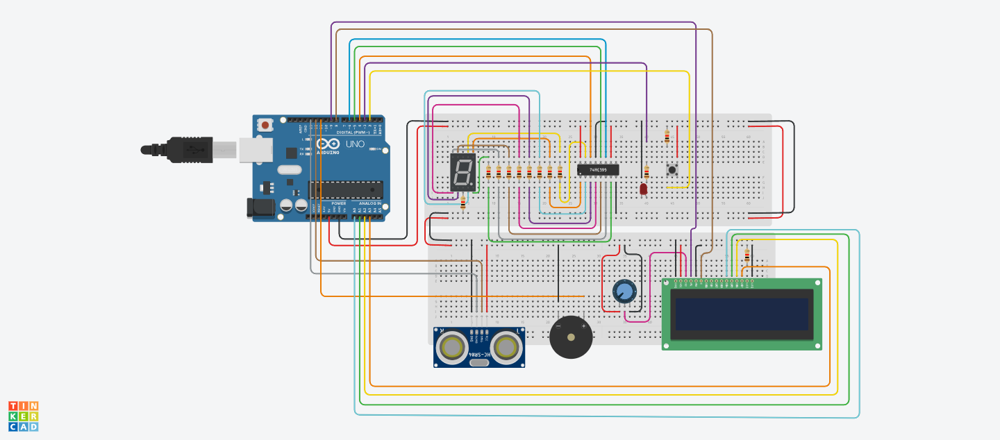

# Design Description

This is a final project created for an embeded systems class taken in Winter of 2024

The system is a backup sensor for automobiles. When the ultrasonic sensor detects an object
within 1 meter an audio and visual alarm sounds with increasing frequency as the object gets
closer. 

Using USART and an LCD the distance measured by the ultrasonic sensor is displayed
and can be used for telemetry purposes. A seven segment display is included which displays
“zone” numbers with each zone representing 10cm of the 1 meter distance. 

Finally there is a mute button that allows for disabling the audio/video alarm without disabling distance 
measurements. The status of the mute feature is also displayed on the LCD screen.
# Components Used
- Arduino Uno
- 2 x Breadboard
- 1 x UltraSonic Sensor
- 1 x Active Buzzer
- 1 x LCD
- 1 x 7 Segment Display
- 1 x Shift Register
- 1 x LED
- 1 x Push Button
- 10 x 220 Ohm Resistor
- 2 x 1K Ohm Resistor
- M-M wires

# Circuit Diagram

